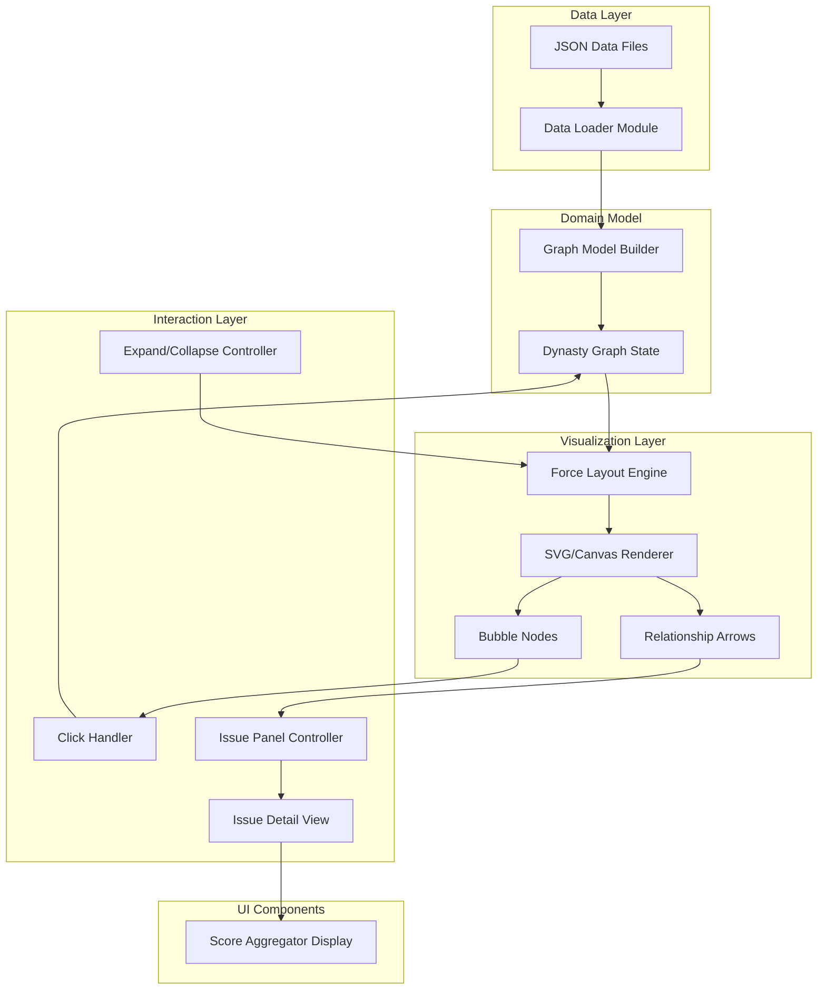
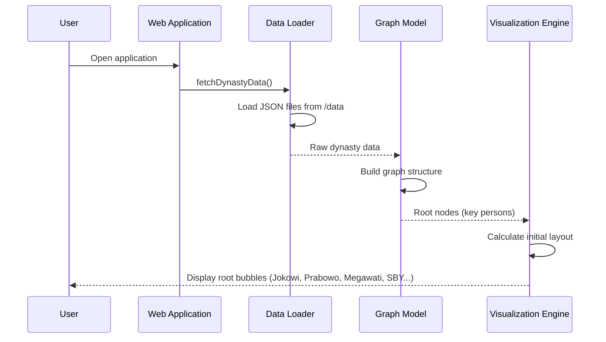
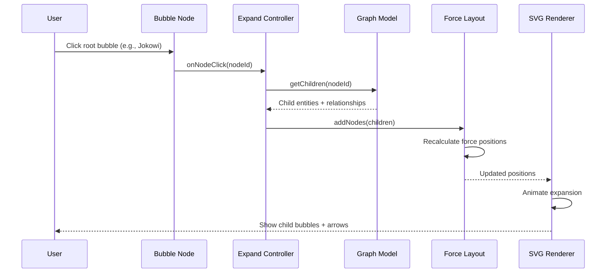
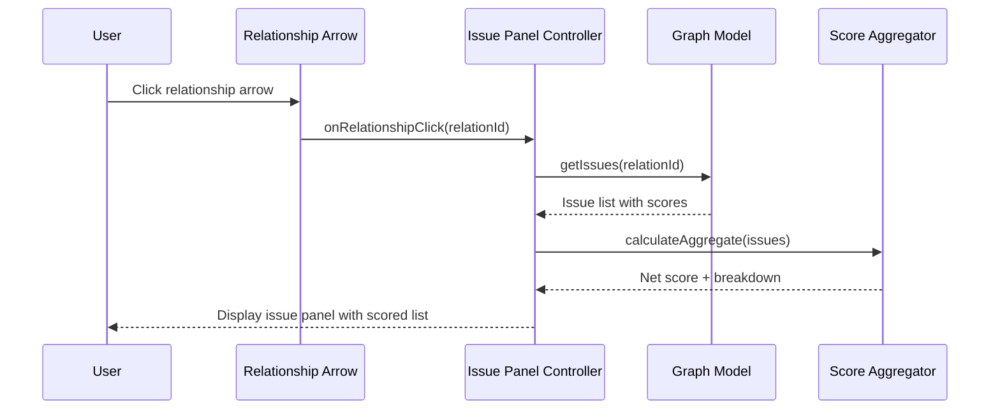

# Design Document: Dynasty Mapping UI

## Overview

The Dynasty Mapping UI is an interactive web-based visualization tool that maps Indonesian political dynasties as hierarchical bubble graphs. Users navigate a force-directed graph starting from key political figures (root nodes), clicking to expand branches that reveal connected entities—parties, family members, allies—with typed arrows showing relationship nature. Each relationship carries an issues list with positive/negative scores, and the aggregate score visually reflects on the connecting arrow (color, thickness, style). The project is open-source with community-editable data stored as structured JSON in the repository, enabling transparent contribution without requiring code knowledge.

The system follows a client-side rendering architecture: static JSON data files are loaded at runtime, parsed into a graph model, and rendered via an interactive SVG/Canvas visualization layer. The design prioritizes accessibility for non-technical contributors (simple JSON schema), rich interactivity (click-to-expand, hover tooltips, issue panels), and extensibility (new dynasties, entities, and issues can be added by editing data files alone).

## Architecture



## Sequence Diagrams

### Initial Load Sequence



### Click-to-Expand Sequence



### Issue Panel Sequence



## Components and Interfaces

### Component 1: Data Loader

**Purpose**: Loads and validates JSON data files from the repository, transforming raw data into typed domain objects.

**Interface**:
```lean
structure DataLoader where
  loadDynasties : IO (List RawDynasty)
  loadEntities : IO (List RawEntity)
  loadRelationships : IO (List RawRelationship)
  loadIssues : IO (List RawIssue)
  validateData : RawDataSet → Except ValidationError ValidDataSet
```

**Responsibilities**:
- Fetch JSON files from the `/data` directory
- Parse raw JSON into typed structures
- Validate referential integrity (all referenced IDs exist)
- Report clear validation errors for malformed data

### Component 2: Graph Model

**Purpose**: Maintains the in-memory graph structure representing dynasties, entities, and their relationships.

**Interface**:
```lean
structure GraphModel where
  rootNodes : List DynastyNode
  getNode : NodeId → Option DynastyNode
  getChildren : NodeId → List DynastyNode
  getRelationship : NodeId → NodeId → Option Relationship
  getIssues : RelationshipId → List Issue
  isExpanded : NodeId → Bool
  toggleExpand : NodeId → GraphModel
```

**Responsibilities**:
- Store hierarchical dynasty graph
- Track expansion state per node
- Provide efficient lookups by ID
- Compute derived relationship scores

### Component 3: Visualization Engine

**Purpose**: Renders the graph as interactive SVG with force-directed layout, handling positioning, animation, and visual encoding of relationship scores.

**Interface**:
```lean
structure VisualizationEngine where
  initialize : HTMLElement → GraphModel → IO Unit
  renderNodes : List DynastyNode → IO Unit
  renderEdges : List Relationship → IO Unit
  animateExpansion : NodeId → List DynastyNode → IO Unit
  animateCollapse : NodeId → IO Unit
  updateEdgeStyle : RelationshipId → AggregateScore → IO Unit
  centerOnNode : NodeId → IO Unit
```

**Responsibilities**:
- Calculate force-directed layout positions
- Render bubble nodes with labels and avatars
- Render typed arrows with score-based styling
- Animate expand/collapse transitions
- Handle zoom and pan

### Component 4: Interaction Controller

**Purpose**: Manages user interactions—click, hover, panel open/close—and coordinates between visualization and model.

**Interface**:
```lean
structure InteractionController where
  onNodeClick : NodeId → IO Unit
  onEdgeClick : RelationshipId → IO Unit
  onNodeHover : NodeId → IO Unit
  onBackgroundClick : IO Unit
  openIssuePanel : RelationshipId → IO Unit
  closeIssuePanel : IO Unit
```

**Responsibilities**:
- Dispatch click events to appropriate handlers
- Manage panel state (open/closed)
- Coordinate expand/collapse with animation
- Handle keyboard navigation

### Component 5: Issue Panel

**Purpose**: Displays the list of issues for a relationship with positive/negative scoring and aggregate calculation.

**Interface**:
```lean
structure IssuePanel where
  display : RelationshipId → List Issue → IO Unit
  calculateAggregate : List Issue → AggregateScore
  sortByScore : List Issue → List Issue
  filterByType : IssueType → List Issue → List Issue
  hide : IO Unit
```

**Responsibilities**:
- Render scrollable issue list
- Color-code positive (green) and negative (red) issues
- Display score scale per issue
- Show aggregate relationship health indicator
- Provide filter/sort controls

## Data Models

### Model: DynastyNode

```lean
inductive NodeType where
  | Person : NodeType
  | Party : NodeType
  | Organization : NodeType
  | Institution : NodeType
  deriving Repr, BEq

structure DynastyNode where
  id : NodeId
  name : String
  nodeType : NodeType
  dynasty : DynastyId
  level : Nat
  description : Option String
  imageUrl : Option String
  deriving Repr
```

**Validation Rules**:
- `id` must be unique across all nodes
- `name` must be non-empty
- `level` 0 indicates root node (key person)
- `dynasty` must reference an existing dynasty

### Model: Relationship

```lean
inductive RelationType where
  | Family : RelationType
  | Political : RelationType
  | Business : RelationType
  | Appointment : RelationType
  | Alliance : RelationType
  | Rivalry : RelationType
  deriving Repr, BEq

structure Relationship where
  id : RelationshipId
  sourceId : NodeId
  targetId : NodeId
  relationType : RelationType
  label : String
  issues : List IssueId
  deriving Repr
```

**Validation Rules**:
- `sourceId` and `targetId` must reference existing nodes
- `sourceId` must be at a lower or equal level than `targetId` (hierarchy flows down)
- `relationType` determines arrow base styling
- `issues` list may be empty (new/undocumented relationships)

### Model: Issue

```lean
inductive IssueType where
  | Positive : IssueType
  | Negative : IssueType
  | Neutral : IssueType
  deriving Repr, BEq

structure Issue where
  id : IssueId
  relationshipId : RelationshipId
  title : String
  description : String
  issueType : IssueType
  score : Int  -- Range: -10 to +10
  date : Option String
  sourceUrl : Option String
  deriving Repr
```

**Validation Rules**:
- `score` must be in range [-10, +10]
- `issueType` must be consistent with score sign (Positive → score > 0, Negative → score < 0, Neutral → score = 0)
- `relationshipId` must reference an existing relationship
- `title` and `description` must be non-empty
- `sourceUrl` should be a valid URL if provided

### Model: AggregateScore

```lean
structure AggregateScore where
  totalScore : Int
  positiveCount : Nat
  negativeCount : Nat
  neutralCount : Nat
  averageScore : Float
  sentiment : Sentiment
  deriving Repr

inductive Sentiment where
  | StrongPositive : Sentiment   -- avg > 5
  | Positive : Sentiment         -- avg > 0
  | Neutral : Sentiment          -- avg = 0
  | Negative : Sentiment         -- avg < 0
  | StrongNegative : Sentiment   -- avg < -5
  deriving Repr, BEq
```

## Algorithmic Pseudocode

### Score Aggregation Algorithm

```lean
def classifySentiment (avg : Float) : Sentiment :=
  if avg > 5.0 then Sentiment.StrongPositive
  else if avg > 0.0 then Sentiment.Positive
  else if avg == 0.0 then Sentiment.Neutral
  else if avg > -5.0 then Sentiment.Negative
  else Sentiment.StrongNegative

def calculateAggregate (issues : List Issue) : AggregateScore :=
  let totalScore := issues.foldl (fun acc i => acc + i.score) 0
  let positiveCount := issues.filter (fun i => i.score > 0) |>.length
  let negativeCount := issues.filter (fun i => i.score < 0) |>.length
  let neutralCount := issues.filter (fun i => i.score == 0) |>.length
  let count := issues.length
  let averageScore := if count == 0 then 0.0
                      else Float.ofInt totalScore / Float.ofNat count
  let sentiment := classifySentiment averageScore
  { totalScore, positiveCount, negativeCount, neutralCount, averageScore, sentiment }
```

**Preconditions:**
- All issues in the list have valid scores in range [-10, +10]
- Issue list may be empty

**Postconditions:**
- `totalScore = sum of all issue scores`
- `positiveCount + negativeCount + neutralCount = issues.length`
- `sentiment` correctly classifies the average score

**Loop Invariants:**
- Running sum remains the sum of all processed issue scores
- Counts correctly categorize all processed issues

### Graph Expansion Algorithm

```lean
def expandNode (model : GraphModel) (nodeId : NodeId) : GraphModel :=
  match model.getNode nodeId with
  | none => model  -- Node not found, no change
  | some node =>
    if model.isExpanded nodeId then
      model  -- Already expanded, no change
    else
      let children := model.getChildren nodeId
      let updatedModel := model.toggleExpand nodeId
      -- Children are now visible in the graph
      updatedModel

def collapseNode (model : GraphModel) (nodeId : NodeId) : GraphModel :=
  match model.getNode nodeId with
  | none => model
  | some node =>
    if ¬(model.isExpanded nodeId) then
      model  -- Already collapsed
    else
      -- Recursively collapse all descendants
      let children := model.getChildren nodeId
      let collapsedChildren := children.foldl
        (fun m child => collapseNode m child.id) model
      collapsedChildren.toggleExpand nodeId
```

**Preconditions:**
- `model` is a valid graph with no cycles
- `nodeId` references an existing node in the model

**Postconditions:**
- For `expandNode`: if node exists and was collapsed, it is now expanded; children are accessible
- For `collapseNode`: node and all descendants are collapsed

**Loop Invariants:**
- Graph remains acyclic after any expand/collapse operation
- All node IDs remain unique
- Parent-child relationships are preserved

### Edge Style Computation Algorithm

```lean
inductive EdgeStyle where
  | thick_green : EdgeStyle      -- Strong positive
  | medium_green : EdgeStyle     -- Positive
  | thin_gray : EdgeStyle        -- Neutral
  | medium_red : EdgeStyle       -- Negative
  | thick_red_dashed : EdgeStyle -- Strong negative
  deriving Repr, BEq

def computeEdgeStyle (score : AggregateScore) : EdgeStyle :=
  match score.sentiment with
  | Sentiment.StrongPositive => EdgeStyle.thick_green
  | Sentiment.Positive => EdgeStyle.medium_green
  | Sentiment.Neutral => EdgeStyle.thin_gray
  | Sentiment.Negative => EdgeStyle.medium_red
  | Sentiment.StrongNegative => EdgeStyle.thick_red_dashed
```

**Preconditions:**
- `score` is a valid `AggregateScore` with correctly classified sentiment

**Postconditions:**
- Returns an `EdgeStyle` that uniquely maps to the sentiment classification
- Mapping is deterministic and total (all sentiment values handled)

### Data Validation Algorithm

```lean
inductive ValidationError where
  | DuplicateId : String → ValidationError
  | MissingReference : String → String → ValidationError
  | InvalidScore : IssueId → Int → ValidationError
  | EmptyField : String → String → ValidationError
  | InconsistentType : IssueId → IssueType → Int → ValidationError
  deriving Repr

def validateIssue (issue : Issue) : Except ValidationError Issue := do
  if issue.title.isEmpty then
    throw (ValidationError.EmptyField issue.id "title")
  if issue.description.isEmpty then
    throw (ValidationError.EmptyField issue.id "description")
  if issue.score < -10 ∨ issue.score > 10 then
    throw (ValidationError.InvalidScore issue.id issue.score)
  match issue.issueType with
  | IssueType.Positive =>
    if issue.score ≤ 0 then
      throw (ValidationError.InconsistentType issue.id issue.issueType issue.score)
  | IssueType.Negative =>
    if issue.score ≥ 0 then
      throw (ValidationError.InconsistentType issue.id issue.issueType issue.score)
  | IssueType.Neutral =>
    if issue.score ≠ 0 then
      throw (ValidationError.InconsistentType issue.id issue.issueType issue.score)
  pure issue

def validateDataSet (data : RawDataSet) : Except (List ValidationError) ValidDataSet := do
  -- Check all node IDs are unique
  let nodeIds := data.nodes.map (·.id)
  let duplicates := findDuplicates nodeIds
  if ¬duplicates.isEmpty then
    throw (duplicates.map ValidationError.DuplicateId)
  -- Check all relationship references exist
  for rel in data.relationships do
    if ¬(nodeIds.contains rel.sourceId) then
      throw [ValidationError.MissingReference rel.id rel.sourceId]
    if ¬(nodeIds.contains rel.targetId) then
      throw [ValidationError.MissingReference rel.id rel.targetId]
  -- Validate all issues
  for issue in data.issues do
    match validateIssue issue with
    | Except.error e => throw [e]
    | Except.ok _ => pure ()
  pure (toValidDataSet data)
```

**Preconditions:**
- `data` is parseable JSON (syntactically valid)
- All required fields are present in the raw data

**Postconditions:**
- Returns `ValidDataSet` if and only if all validations pass
- Returns comprehensive error list describing all violations found
- No partial state: either all data is valid or validation fails

**Loop Invariants:**
- All previously validated entries remain valid
- Error accumulation captures all found issues up to first critical failure

## Key Functions with Formal Specifications

### Function: loadAndValidateData

```lean
def loadAndValidateData (dataPath : String) : IO (Except (List ValidationError) ValidDataSet)
```

**Preconditions:**
- `dataPath` points to an accessible directory
- Directory contains `dynasties.json`, `entities.json`, `relationships.json`, `issues.json`
- Files are valid JSON syntax

**Postconditions:**
- Returns `Except.ok validData` if all files parse and validate successfully
- Returns `Except.error errors` with descriptive error list otherwise
- No side effects beyond file I/O reads

### Function: buildGraphFromData

```lean
def buildGraphFromData (data : ValidDataSet) : GraphModel
```

**Preconditions:**
- `data` has passed all validation checks
- All referential integrity constraints are satisfied

**Postconditions:**
- Returns a `GraphModel` where every node is reachable from a root
- Root nodes (level 0) are the initial visible set
- All relationships are bidirectionally navigable
- Graph is a DAG (directed acyclic graph)

### Function: renderBubbleNode

```lean
def renderBubbleNode (node : DynastyNode) (position : Position) (isExpanded : Bool) : IO SVGElement
```

**Preconditions:**
- `node` is a valid `DynastyNode` with non-empty name
- `position` is within viewport bounds
- SVG container exists in DOM

**Postconditions:**
- Returns an SVG group element containing circle, label, and optional image
- Bubble size scales with number of children (larger = more connections)
- Color reflects `nodeType` (Person=blue, Party=orange, Organization=purple, Institution=green)
- Expanded nodes show a subtle glow effect

### Function: renderRelationshipArrow

```lean
def renderRelationshipArrow (rel : Relationship) (sourcePos : Position) (targetPos : Position) (style : EdgeStyle) : IO SVGElement
```

**Preconditions:**
- `sourcePos` and `targetPos` are valid positions in viewport
- `style` has been computed from aggregate score
- Both source and target nodes are currently visible

**Postconditions:**
- Returns SVG path element with appropriate styling (color, thickness, dash pattern)
- Arrow points from source to target
- Label text shows relationship type
- Arrow is clickable (has event listener for issue panel)

## Example Usage

```lean
-- Example 1: Loading dynasty data at application start
def main : IO Unit := do
  let result ← loadAndValidateData "./data"
  match result with
  | Except.ok validData =>
    let model := buildGraphFromData validData
    let engine ← VisualizationEngine.initialize (getContainer "app") model
    engine.renderNodes model.rootNodes
  | Except.error errors =>
    IO.eprintln s!"Data validation failed: {errors}"

-- Example 2: Handling node click
def handleNodeClick (ctrl : InteractionController) (model : GraphModel) (nodeId : NodeId) : IO GraphModel := do
  let newModel := expandNode model nodeId
  let children := newModel.getChildren nodeId
  let relationships := children.map (fun child =>
    newModel.getRelationship nodeId child.id)
  ctrl.onNodeClick nodeId
  pure newModel

-- Example 3: Computing and displaying relationship score
def showRelationshipDetails (panel : IssuePanel) (model : GraphModel) (relId : RelationshipId) : IO Unit := do
  let issues := model.getIssues relId
  let aggregate := panel.calculateAggregate issues
  panel.display relId issues
  let style := computeEdgeStyle aggregate
  IO.println s!"Relationship sentiment: {aggregate.sentiment}"
  IO.println s!"Score: {aggregate.totalScore} ({aggregate.positiveCount}+ / {aggregate.negativeCount}-)"

-- Example 4: Sample data construction
def sampleJokowiDynasty : DynastyNode :=
  { id := "jokowi-001"
  , name := "Joko Widodo"
  , nodeType := NodeType.Person
  , dynasty := "solo-dynasty"
  , level := 0
  , description := some "7th President of Indonesia (2014-2024)"
  , imageUrl := some "/images/jokowi.jpg" }

def sampleRelationship : Relationship :=
  { id := "rel-jokowi-gibran"
  , sourceId := "jokowi-001"
  , targetId := "gibran-001"
  , relationType := RelationType.Family
  , label := "Father-Son"
  , issues := ["issue-001", "issue-002", "issue-003"] }

def sampleIssue : Issue :=
  { id := "issue-001"
  , relationshipId := "rel-jokowi-gibran"
  , title := "Solo Mayor Appointment Controversy"
  , description := "Gibran's fast-tracked candidacy for Solo mayor raised nepotism concerns"
  , issueType := IssueType.Negative
  , score := -6
  , date := some "2020-12-09"
  , sourceUrl := some "https://example.com/source" }
```

## Correctness Properties

*A property is a characteristic or behavior that should hold true across all valid executions of a system—essentially, a formal statement about what the system should do. Properties serve as the bridge between human-readable specifications and machine-verifiable correctness guarantees.*

### Property 1: Data parsing round-trip

*For any* valid set of typed domain objects (DynastyNode, Relationship, Issue), serializing them to JSON and parsing back SHALL produce equivalent objects.

**Validates: Requirement 1.2**

### Property 2: Validation rejects all violation types

*For any* dataset with a single injected violation (duplicate ID, dangling reference, out-of-range score, inconsistent type/score, whitespace-only required field, level ordering violation, missing root node, or dangling issue relationshipId), the Validator SHALL reject the dataset and report an error identifying the specific violation.

**Validates: Requirements 2.1, 2.2, 2.3, 2.4, 2.5, 2.7, 2.8, 2.9**

### Property 3: Validation error reports are complete

*For any* invalid dataset rejected by the Validator, every error report SHALL contain the entity ID, the field name, and a description of the violation, and the Validator SHALL execute all rules to completion reporting every failure found.

**Validates: Requirement 2.6**

### Property 4: Graph query correctness

*For any* valid dataset used to construct a Graph_Model: (a) getNode(id) returns the correct node for every node in the dataset and returns no result for IDs not in the graph, (b) getChildren(id) returns exactly the target nodes of relationships whose sourceId equals the given node's ID (or empty if none), (c) getRelationship(source, target) returns the correct relationship or no result if none connects the pair, and (d) getIssues(relId) returns exactly the issues referencing that relationship (or empty if none).

**Validates: Requirements 3.3, 3.4, 3.5, 3.6**

### Property 5: Root node identification

*For any* valid dataset, the Graph_Model root nodes SHALL equal exactly the set of level-0 DynastyNodes, and the initial display SHALL show only these root nodes in a collapsed state.

**Validates: Requirements 3.2, 4.6, 12.1**

### Property 6: Graph acyclicity and reachability

*For any* valid dataset, the constructed Graph_Model SHALL be a directed acyclic graph where every DynastyNode is reachable from at least one Root_Node. For any dataset containing a cycle, the Graph_Model SHALL detect and report all DynastyNode IDs participating in the cycle.

**Validates: Requirements 3.1, 3.7, 3.8**

### Property 7: Expand reveals children and marks state

*For any* collapsed DynastyNode with one or more children, expanding it SHALL add all direct child nodes and their connecting relationships to the visible set, and the node SHALL be marked as expanded.

**Validates: Requirements 4.1, 4.3**

### Property 8: Collapse hides all descendants recursively

*For any* expanded DynastyNode, collapsing it SHALL remove all descendant nodes from the visible set and set each descendant (including any expanded ones) to collapsed state.

**Validates: Requirements 4.2, 4.5**

### Property 9: Expand is idempotent

*For any* DynastyNode and any graph state, expanding a node that is already expanded SHALL produce no state change (expandNode(expandNode(model, id), id) = expandNode(model, id)).

**Validates: Requirement 4.4**

### Property 10: Leaf node click is a no-op

*For any* DynastyNode that has no child nodes (leaf node), clicking it SHALL produce no expansion or collapse state change.

**Validates: Requirement 4.7**

### Property 11: Collapse reverses expand for leaf-parent nodes

*For any* DynastyNode whose children have no expanded descendants, collapsing after expanding SHALL restore the original graph state.

**Validates: Requirements 4.1, 4.2**

### Property 12: Score aggregation arithmetic

*For any* list of Issues with scores in range [-10, +10], the Score_Aggregator SHALL compute totalScore equal to the sum of all individual scores, and averageScore equal to totalScore divided by the number of issues rounded to 2 decimal places.

**Validates: Requirements 8.1, 8.3**

### Property 13: Score aggregation partition completeness

*For any* list of Issues, positiveCount + negativeCount + neutralCount SHALL equal the total number of issues in the list, where positiveCount counts issues with score > 0, negativeCount counts issues with score < 0, and neutralCount counts issues with score = 0.

**Validates: Requirement 8.2**

### Property 14: Sentiment classification consistency

*For any* AggregateScore, the sentiment classification SHALL match exactly one non-overlapping range: averageScore > 5 → StrongPositive, 0 < averageScore ≤ 5 → Positive, averageScore = 0 → Neutral, -5 ≤ averageScore < 0 → Negative, averageScore < -5 → StrongNegative.

**Validates: Requirement 8.5**

### Property 15: Edge style determinism

*For any* two AggregateScores with the same sentiment classification, computeEdgeStyle SHALL return the same EdgeStyle. The mapping SHALL be: StrongPositive → 4px solid green, Positive → 2px solid green, Neutral → 1px solid gray, Negative → 2px solid red, StrongNegative → 4px dashed red.

**Validates: Requirement 7.3**

### Property 16: Issue sorting correctness

*For any* list of Issues, sorting by score (highest to lowest) SHALL produce a list where each element's score is ≥ the next element's score, and sorting by date (newest to oldest) SHALL produce a list where each element's date is ≥ the next element's date.

**Validates: Requirements 9.1, 9.5**

### Property 17: Issue filtering correctness

*For any* list of Issues and any filter type (Positive, Negative, Neutral), filtering SHALL return only issues matching that type, and no matching issue from the original list SHALL be excluded.

**Validates: Requirement 9.6**

### Property 18: HTML sanitization

*For any* string containing HTML special characters (<, >, &, ", '), the Visualization_Engine's sanitization SHALL escape all such characters to their HTML entity equivalents before DOM insertion, producing output that cannot be interpreted as HTML markup.

**Validates: Requirement 10.1**

### Property 19: URL scheme validation

*For any* string provided as a sourceUrl or imageUrl, the Data_Loader SHALL accept only URLs with http: or https: scheme conforming to standard URL syntax. URLs with disallowed schemes or invalid syntax SHALL be rejected (sourceUrl rendered as sanitized plain text, imageUrl excluded from rendering).

**Validates: Requirements 10.2, 10.3, 10.4**

### Property 20: DOM reflects only visible nodes

*For any* graph state with mixed expanded/collapsed nodes, the Visualization_Engine SHALL render only currently visible nodes in the DOM—collapsed subtrees SHALL have no DOM elements.

**Validates: Requirement 11.2**

### Property 21: Bubble rendering encodes node type and name

*For any* DynastyNode, the rendered bubble SHALL contain the entity name as a label (truncated with ellipsis if exceeding 24 characters) and SHALL apply the correct color based on node type (Person=blue, Party=orange, Organization=purple, Institution=green).

**Validates: Requirements 6.1, 6.3**

### Property 22: Bubble size scales with children count

*For any* two DynastyNodes where one has more direct children than the other, the node with more children SHALL have a larger rendered bubble diameter, bounded between minimum (0 children) and maximum (20+ children).

**Validates: Requirement 6.2**

### Property 23: Issue panel displays complete information

*For any* Issue rendered in the Issue_Panel, the display SHALL include the title, description (up to 200 characters with "show more" for longer text), score, date (YYYY-MM-DD format), and source URL (as clickable link opening in new tab), with color-coding matching the issue type (green=Positive, red=Negative, gray=Neutral).

**Validates: Requirements 9.2, 9.3**

### Property 24: Score aggregation cache consistency

*For any* Relationship, the cached AggregateScore SHALL equal the freshly computed AggregateScore. When an Issue belonging to that Relationship is added, removed, or has its score modified, the cached entry SHALL be invalidated.

**Validates: Requirement 11.4**

## Error Handling

### Error Scenario 1: Invalid Data File

**Condition**: JSON files in `/data` directory are malformed or contain invalid references
**Response**: Application displays a clear error page listing all validation failures with file name, line context, and suggested fix
**Recovery**: User corrects the JSON file; application reloads and re-validates on next page load

### Error Scenario 2: Missing Node Reference in Relationship

**Condition**: A relationship references a `sourceId` or `targetId` that doesn't exist in entities
**Response**: Validation reports `MissingReference` error with the relationship ID and missing node ID
**Recovery**: Contributor adds the missing entity or corrects the ID in the relationship file

### Error Scenario 3: Circular Dependency Detection

**Condition**: Data implies a cycle (node A → B → C → A)
**Response**: Graph builder detects cycle during construction and reports affected nodes
**Recovery**: Data contributor restructures relationships to maintain hierarchy (DAG constraint)

### Error Scenario 4: Empty Dynasty (No Root Node)

**Condition**: A dynasty is defined but has no level-0 node
**Response**: Validation warns about orphaned dynasty; dynasty is excluded from initial render
**Recovery**: Contributor adds a root person node with level 0 for that dynasty

### Error Scenario 5: Browser Rendering Performance

**Condition**: Too many nodes expanded simultaneously (>200 visible nodes)
**Response**: System shows performance warning and suggests collapsing some branches; limits force simulation iterations
**Recovery**: User collapses branches; system implements level-of-detail rendering for distant nodes

## Testing Strategy

### Unit Testing Approach

Focus on pure functions that form the core logic:
- Score aggregation: test with empty lists, all-positive, all-negative, mixed scores
- Validation functions: test each validation rule independently
- Edge style computation: test all sentiment boundaries
- Graph operations: test expand/collapse on various graph shapes

### Property-Based Testing Approach

**Property Test Library**: fast-check (JavaScript/TypeScript property-based testing)

Key properties to test:
1. **Aggregate sum correctness**: For any list of issues, totalScore equals the sum of individual scores
2. **Idempotent expand**: Expanding an already-expanded node produces no state change
3. **Validation completeness**: Any issue that passes validation has score in [-10, +10] and consistent type
4. **Graph acyclicity**: After any sequence of expand/collapse operations, the visible graph remains a DAG
5. **Edge style totality**: Every possible aggregate score maps to exactly one edge style

### Integration Testing Approach

- **Data loading pipeline**: Load sample data files, validate, build graph, verify structure matches expectations
- **Click interaction flow**: Simulate click on root node, verify children appear with correct positions
- **Issue panel flow**: Click relationship arrow, verify panel shows correct issues with accurate aggregate

## Performance Considerations

- **Lazy loading**: Only render visible nodes; collapsed subtrees are not in the DOM
- **Force simulation budgeting**: Limit simulation ticks per frame; use web workers for layout computation on large graphs
- **Virtual scrolling**: Issue panel uses virtual scroll for relationships with many issues (>50)
- **Data splitting**: Each dynasty's data can be loaded independently to reduce initial payload
- **Caching**: Computed aggregate scores are cached and invalidated only when issues change
- **SVG optimization**: Use `<use>` elements for repeated shapes; batch DOM updates

## Security Considerations

- **Data integrity**: All data is static JSON served from the repository; no user input reaches a server
- **XSS prevention**: Entity names and descriptions are sanitized before DOM insertion (escape HTML entities)
- **URL validation**: `sourceUrl` fields in issues are validated as proper URLs before rendering as links
- **Content policy**: Community contributions go through pull request review before merging to main
- **No authentication**: The tool is read-only and public; no user accounts or sessions required

## Dependencies

- **D3.js** (or similar): Force-directed graph layout and SVG manipulation
- **Web framework** (optional): Lightweight framework for component structure (Svelte, Preact, or vanilla)
- **JSON Schema**: For data validation tooling (ajv or similar)
- **CSS framework** (optional): Tailwind CSS or custom styles for panel UI
- **Build tool**: Vite for development server and production builds
- **Testing**: Vitest + fast-check for unit and property-based tests

## Data Format Specification

### File Structure

```
/data
├── dynasties.json      # Dynasty definitions (root metadata)
├── entities.json       # All people, parties, organizations
├── relationships.json  # Connections between entities
└── issues.json         # Issues affecting relationships
```

### Example: dynasties.json

```json
[
  {
    "id": "solo-dynasty",
    "name": "Solo Dynasty (Jokowi)",
    "description": "Political dynasty centered around Joko Widodo",
    "rootEntityId": "jokowi-001"
  },
  {
    "id": "cendana-dynasty",
    "name": "Cendana Dynasty (Prabowo/Suharto)",
    "description": "Political dynasty linked to the Suharto family and Prabowo Subianto",
    "rootEntityId": "prabowo-001"
  }
]
```

### Example: entities.json

```json
[
  {
    "id": "jokowi-001",
    "name": "Joko Widodo",
    "type": "person",
    "dynasty": "solo-dynasty",
    "level": 0,
    "description": "7th President of Indonesia (2014-2024)",
    "imageUrl": "/images/jokowi.jpg"
  },
  {
    "id": "gibran-001",
    "name": "Gibran Rakabuming",
    "type": "person",
    "dynasty": "solo-dynasty",
    "level": 1,
    "description": "Vice President of Indonesia (2024-present), son of Jokowi",
    "imageUrl": "/images/gibran.jpg"
  },
  {
    "id": "psi-001",
    "name": "PSI (Partai Solidaritas Indonesia)",
    "type": "party",
    "dynasty": "solo-dynasty",
    "level": 1,
    "description": "Political party closely associated with Jokowi's political circle",
    "imageUrl": "/images/psi.png"
  },
  {
    "id": "kaesang-001",
    "name": "Kaesang Pangarep",
    "type": "person",
    "dynasty": "solo-dynasty",
    "level": 1,
    "description": "PSI chairman, youngest son of Jokowi",
    "imageUrl": "/images/kaesang.jpg"
  },
  {
    "id": "bahlil-001",
    "name": "Bahlil Lahadalia",
    "type": "person",
    "dynasty": "solo-dynasty",
    "level": 1,
    "description": "Golkar politician, Minister of Energy under Jokowi",
    "imageUrl": "/images/bahlil.jpg"
  }
]
```

### Example: relationships.json

```json
[
  {
    "id": "rel-jokowi-gibran",
    "sourceId": "jokowi-001",
    "targetId": "gibran-001",
    "type": "family",
    "label": "Father → Son"
  },
  {
    "id": "rel-jokowi-kaesang",
    "sourceId": "jokowi-001",
    "targetId": "kaesang-001",
    "type": "family",
    "label": "Father → Son"
  },
  {
    "id": "rel-jokowi-psi",
    "sourceId": "jokowi-001",
    "targetId": "psi-001",
    "type": "political",
    "label": "Political Backing"
  },
  {
    "id": "rel-jokowi-bahlil",
    "sourceId": "jokowi-001",
    "targetId": "bahlil-001",
    "type": "appointment",
    "label": "Ministerial Appointment"
  },
  {
    "id": "rel-kaesang-psi",
    "sourceId": "kaesang-001",
    "targetId": "psi-001",
    "type": "political",
    "label": "Party Chairman"
  }
]
```

### Example: issues.json

```json
[
  {
    "id": "issue-001",
    "relationshipId": "rel-jokowi-gibran",
    "title": "VP Candidacy Age Limit Controversy",
    "description": "Constitutional Court adjusted age requirement enabling Gibran's VP candidacy, raising nepotism concerns",
    "type": "negative",
    "score": -8,
    "date": "2023-10-16",
    "sourceUrl": "https://example.com/mk-decision"
  },
  {
    "id": "issue-002",
    "relationshipId": "rel-jokowi-gibran",
    "title": "Solo Mayor Performance",
    "description": "Gibran's tenure as Solo mayor received mixed reviews with some positive infrastructure programs",
    "type": "positive",
    "score": 4,
    "date": "2021-06-15",
    "sourceUrl": "https://example.com/solo-review"
  },
  {
    "id": "issue-003",
    "relationshipId": "rel-jokowi-psi",
    "title": "PSI Support for Jokowi Agenda",
    "description": "PSI consistently supported Jokowi's legislative agenda in parliament",
    "type": "positive",
    "score": 6,
    "date": "2022-03-01",
    "sourceUrl": "https://example.com/psi-support"
  },
  {
    "id": "issue-004",
    "relationshipId": "rel-jokowi-bahlil",
    "title": "Controversial Mining Permits",
    "description": "Bahlil's ministry issued mining permits that critics linked to political patronage",
    "type": "negative",
    "score": -5,
    "date": "2023-08-20",
    "sourceUrl": "https://example.com/mining-permits"
  }
]
```

### Contribution Guidelines for Data

Contributors can add or update data by:
1. Fork the repository
2. Edit JSON files in `/data` directory following the schema above
3. Ensure all IDs are unique (use format: `{type}-{name}-{number}`)
4. Ensure all references point to existing entities
5. Provide `sourceUrl` for issues when possible (accountability)
6. Submit a pull request for community review
